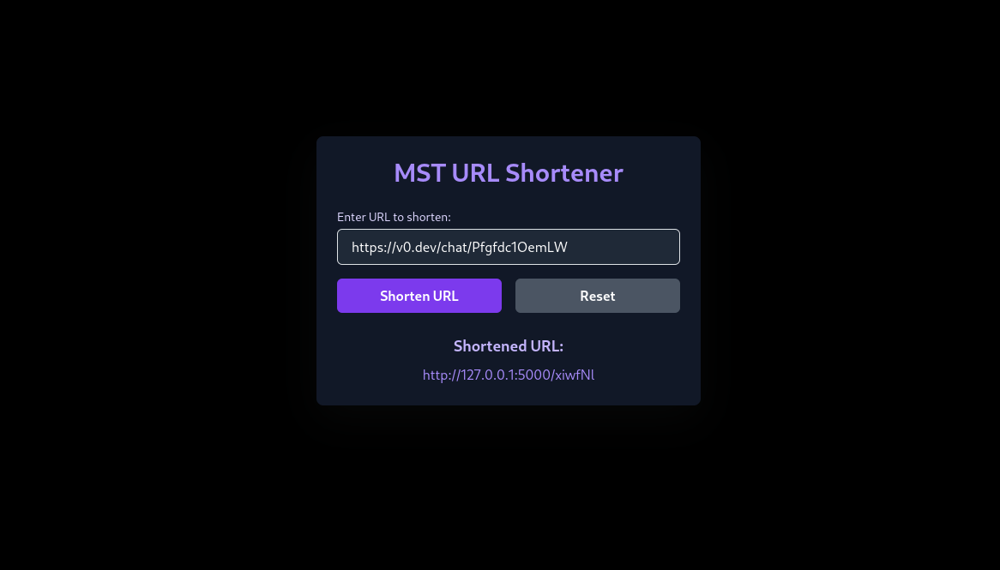

# URL Shortener

This is a simple URL shortener web application built with **Flask** and **Flask-RESTful**. It uses a **JSON file** for data storage to store the mappings between long URLs and their corresponding short URLs. The application also provides a basic frontend with a dark theme using **HTML**, **CSS**, **Bootstrap**, and **Tailwind CSS**.

## Screenshot

Here is a screenshot of the application in action:



## Features

- Shorten URLs and get a unique short URL.
- Redirect to the original long URL when visiting the short URL.
- Prevent re-shortening of URLs that have already been shortened.
- Store URL data in a JSON file for persistence.

## Technologies Used

- **Flask**: Web framework for building the application.
- **Flask-RESTful**: Extension for building RESTful APIs.
- **JSON**: Used to store URL data (both long URLs and short URLs) in a file.
- **HTML/CSS**: Frontend for the URL shortening form.
- **Bootstrap** & **Tailwind CSS**: Styling frameworks used for building a responsive, dark-themed frontend.

## Installation

1. Clone the repository:

    ```bash
    git clone https://github.com/yourusername/url-shortener.git
    cd url-shortener
    ```

2. Create a virtual environment (optional but recommended):

    ```bash
    python3 -m venv venv
    source venv/bin/activate  # On Windows use `venv\Scripts\activate`
    ```

3. Install the required dependencies:

    ```bash
    pip install -r requirements.txt
    ```

    Or, if you don't have `requirements.txt`, you can manually install the dependencies:

    ```bash
    pip install flask flask-restful
    ```

4. Start the Flask server:

    ```bash
    python app.py
    ```

5. Open your browser and visit `http://localhost:5000` to start using the URL shortener.

