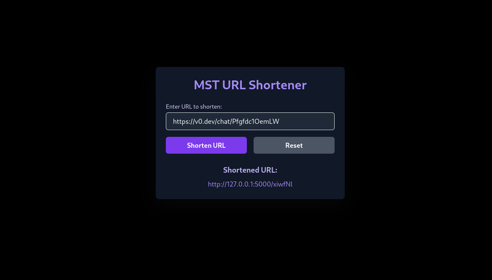

# MST URL Shortener

A lightweight, self-hosted URL shortener built with Flask. Create short links, track clicks, generate QR codes, and manage everything from an admin panel.



## Features

- **URL Shortening** — Create short links with auto-generated or custom keywords
- **Click Tracking** — Monitor how many times each short URL is visited
- **QR Code Generation** — Instantly generate and download QR codes for any short URL
- **Reverse Lookup** — Enter a short keyword to find the original URL
- **Expiry System** — Auto-delete short URLs after a set time (seconds, minutes, hours, days, weeks, or months)
- **Max Views Limit** — Auto-delete a short URL after it reaches a click limit (e.g., one-time view links)
- **Duplicate Prevention** — The same long URL always maps to the same short URL
- **Admin Panel** — Secure dashboard to view, search, filter, sort, and delete all shortened URLs
- **Dark Theme** — Modern purple-accented dark UI on all pages
- **Dual Storage** — Use MongoDB (production) or a local JSON file (development)

## Tech Stack

| Layer | Technology |
|-------|-----------|
| Backend | Python 3.14, Flask, Flask-RESTful |
| Database | MongoDB (via PyMongo) or JSON file |
| Frontend | HTML, CSS, Bootstrap 5, Vanilla JavaScript |
| QR Codes | `qrcode` + Pillow |
| Deployment | Docker + Gunicorn, or Vercel |
| Package Manager | uv |

## Quick Start

### Prerequisites

- Python 3.14 or higher
- `uv` package manager (recommended) or `pip`
- A MongoDB instance (local or cloud — e.g., [MongoDB Atlas free tier](https://www.mongodb.com/atlas))

### 1. Clone the repo

```bash
git clone https://github.com/yourusername/url-shortner-lite.git
cd url-shortner-lite
```

### 2. Set up environment

```bash
cp env_sample .env
```

Edit `.env` and fill in your values:

```env
# Required — your MongoDB connection string
MONGO_URI=mongodb://localhost:27017/url_shortener

# Set to true to use a local JSON file instead of MongoDB (for quick testing)
USE_JSON_FILE=false

# Admin panel credentials
ADMIN_USERNAME=admin
ADMIN_PASSWORD=changeme

# Set to true in production behind HTTPS
SESSION_COOKIE_SECURE=false

# Set to true for debug mode (auto-reload, verbose errors)
FLASK_DEBUG=false
```

### 3. Install dependencies

With **uv** (recommended):

```bash
uv sync
```

With **pip**:

```bash
pip install -r requirements.txt
# or manually:
pip install flask flask-restful pymongo python-dotenv qrcode pillow gunicorn
```

### 4. Run the app

Development (Flask dev server):

```bash
uv run python app.py
# or: python app.py
```

Production (Gunicorn):

```bash
uv run gunicorn -w 4 -b 0.0.0.0:5000 app:app
```

Open **http://localhost:5000** in your browser.

## Deployment

### Docker (recommended for production)

```bash
# Build and run with docker-compose
docker compose up --build -d
```

This uses Gunicorn with 4 workers, has a health check, and reads your `.env` file automatically.

To stop:

```bash
docker compose down
```

### Vercel

The project includes a `vercel.json` for one-click deployment:

```bash
vercel deploy
```

> **Note:** Vercel's serverless functions do not persist state. For production use with MongoDB, ensure `MONGO_URI` is set in Vercel's environment variables.

### Manual / VPS

```bash
# Install system deps
apt install python3.14 python3.14-venv

# Clone and set up
git clone <repo-url> && cd url-shortner-lite
python3 -m venv venv
source venv/bin/activate
uv sync  # or pip install -r requirements.txt

# Configure
cp env_sample .env
nano .env  # set MONGO_URI, ADMIN_PASSWORD

# Run with Gunicorn
gunicorn -w 4 -b 0.0.0.0:5000 app:app
```

Use a reverse proxy (Nginx/Caddy) in front of Gunicorn for HTTPS, static file serving, and rate limiting.

## Environment Variables

| Variable | Required | Default | Description |
|----------|----------|---------|-------------|
| `MONGO_URI` | Yes (when `USE_JSON_FILE=false`) | — | MongoDB connection string |
| `USE_JSON_FILE` | No | `false` | Use local JSON file instead of MongoDB |
| `ADMIN_USERNAME` | No | `admin` | Admin panel login username |
| `ADMIN_PASSWORD` | No | `changeme` | Admin panel login password |
| `SECRET_KEY` | No | Auto-generated | Flask session signing key. **Set this in production** |
| `SESSION_COOKIE_SECURE` | No | `false` | Set `true` if serving over HTTPS |
| `FLASK_DEBUG` | No | `false` | Enable Flask debug mode |

## API Endpoints

| Method | Endpoint | Description |
|--------|----------|-------------|
| `POST` | `/shorten` | Create a short URL |
| `GET` | `/<short_url>` | Redirect to the original URL |
| `POST` | `/unshorten` | Reverse lookup — get original URL from keyword |
| `GET` | `/stats/<short_url>` | Get click count for a short URL |
| `GET` | `/qr/<short_url>` | Generate QR code image (PNG) |
| `GET` | `/admin` | Admin panel (login required) |

### POST /shorten

```json
{
  "url": "https://example.com/very/long/path",
  "custom_keyword": "my-link",
  "expiry_value": 30,
  "expiry_unit": "days",
  "max_views": 100
}
```

All fields except `url` are optional. Returns:

```json
{
  "short_url": "my-link"
}
```

## Admin Panel

Navigate to **/admin** and log in with the credentials from your `.env` file.

Features:
- View all shortened URLs in a sortable, searchable, paginated table
- Filter by status (All / Active / Expired)
- Sort by date, clicks, or URL name
- Search by short URL, long URL, or IP address
- Visit any short URL with one click
- Delete URLs with confirmation
- View stats: total URLs, total clicks, active count, expired count

## Project Structure

```
.
├── app.py                  # Main Flask application (routes, logic, API)
├── templates/
│   ├── index.html          # Main URL shortening form
│   ├── not_found.html      # 404 error page
│   ├── admin.html          # Admin panel dashboard
│   └── admin_login.html    # Admin login page
├── static/
│   ├── link.png            # Favicon
│   └── ss.png              # Screenshot
├── pyproject.toml          # Python project config + dependencies
├── uv.lock                 # Locked dependency versions
├── Dockerfile              # Docker image definition
├── docker-compose.yml      # Docker Compose config
├── vercel.json             # Vercel deployment config
├── .env                    # Environment variables (not committed)
├── env_sample              # Example .env file
└── README.md               # This file
```

## License

See [LICENSE](LICENSE) for details.
